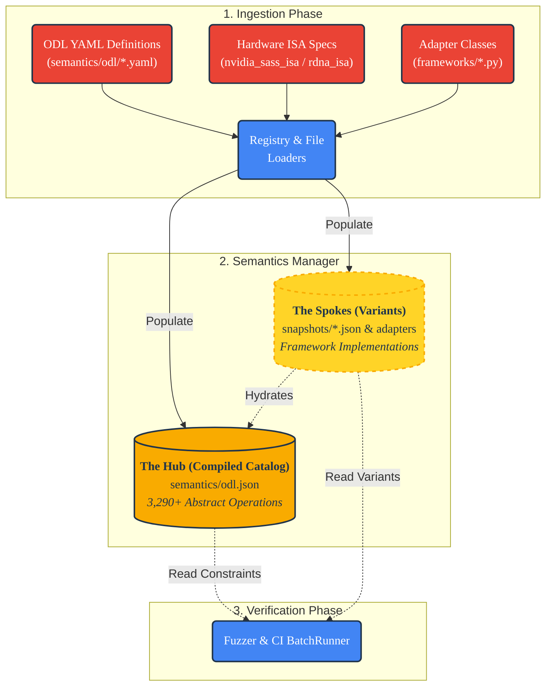
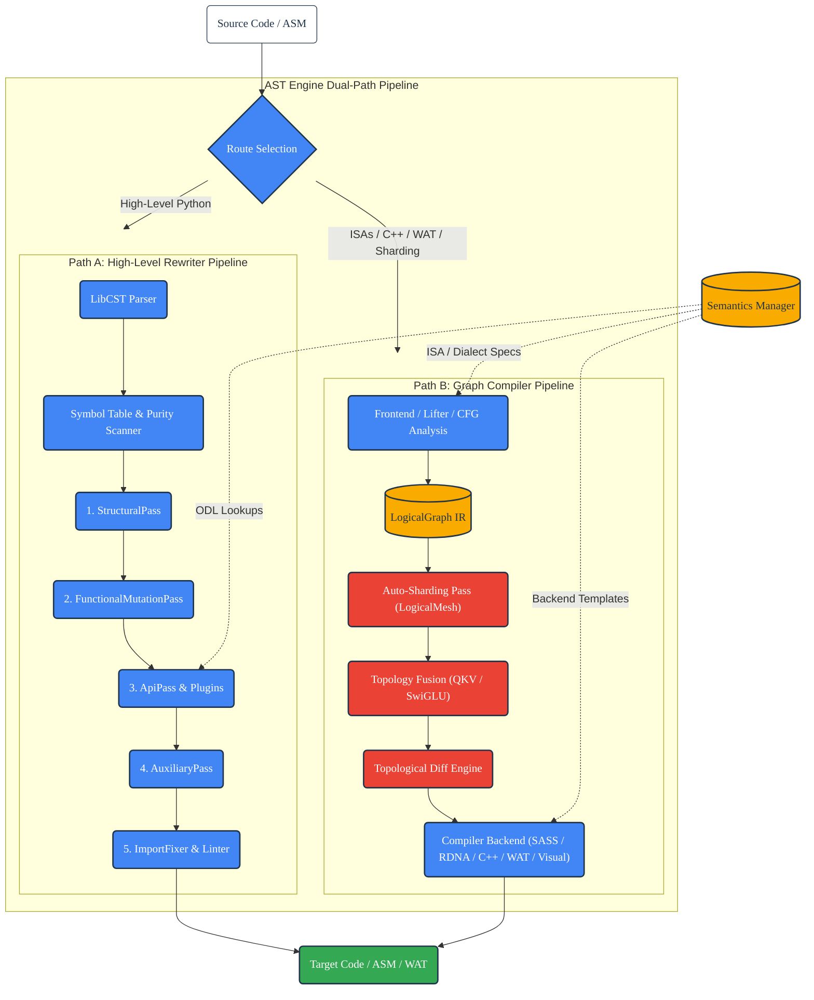

Architecture
============

**ml-switcheroo** is a deterministic, specification-driven **Universal Compiler** for Deep Learning. It translates and compiles computation between high-level frameworks (PyTorch, JAX/Flax NNX, Apple MLX, Keras 3, TensorFlow), intermediate representations (ML-Switcheroo IR, MLIR, StableHLO), native C++ PyBind11 extensions, WebAssembly (WAT), and low-level hardware assembly (NVIDIA SASS, AMD RDNA).

It solves the $O(N^2)$ interoperability problem by decoupling **Specification** (the Abstract Operation) from **Implementation** (the Dialect / Target API) using a **Hub-and-Spoke** architecture. Rather than writing ad-hoc translators for every pair of languages, every dialect maps to a central **Abstract Standard**.

---

## 🏗️ The Semantic Pivot Strategy & Dual-Path Routing

The core pipeline operates on a three-phase semantic pivot:

1. **Ingest (Source $\to$ Hub):** The system identifies framework operations, AST nodes, or machine instructions (e.g., `torch.permute`, `v_fmac_f32`, or `LDG.E.F32`) and maps them to an **Abstract Operation** (e.g., `permute_dims`, `Conv2d`, or `Linear`) using the source dialect's snapshot, ODL catalog, or instruction grammar.
2. **Pivot (Normalization & Optimization):** Arguments, shapes, layouts, and data types are normalized against the Abstract Standard. Graph-level passes (auto-sharding, SwiGLU/QKV fusion, topological diffing) optimize the computational graph.
3. **Project (Hub $\to$ Target):** The system generates the target representation—emitting clean high-level Python AST, native C++ PyBind11 modules, WebAssembly Text instructions, or GPU machine kernels—applying DSL expansion, layout permutations, and plugin hooks.

The `ASTEngine` performs **Route Selection** based on the source and target representations:
* **Rewriter Pipeline (AST-to-AST):** Used for source-to-source translation between high-level Python frameworks (e.g., PyTorch to JAX/NNX). Operates on concrete syntax trees via LibCST.
* **Compiler Pipeline (Graph-to-Backend):** Used when the conversion involves hardware ISAs (NVIDIA SASS, AMD RDNA), native C++ extensions, WebAssembly Text (WAT), visual DSLs (TikZ, HTML, LaTeX), distributed sharding annotations, or intermediate IR formats (`ir`, `mlir`, `stablehlo`).

---

## 🧩 1. The Knowledge Base (Hub & Spoke)

The dataset driving the compiler is partitioned into declarative specifications (The Hub) and dialect overlays (The Spokes).



### The Hub: Operation Definition Language (ODL)

Defines **WHAT** an operation is. The Hub is built from discrete, atomic YAML operation definitions in `src/ml_switcheroo/semantics/odl/` and deterministically compiled into `src/ml_switcheroo/semantics/odl.json` (3,291 compiled operations).

Operations are organized by `SemanticTier`:
* **`ARRAY_API`:** Pure mathematical array operations adhering to the Python Array API standard.
* **`NEURAL`:** Stateful layers and modules (`Linear`, `Conv2d`, `BatchNorm`, `Embedding`).
* **`NEURAL_OPS` / `ACTIVATION`:** Functional activations and neural primitives (`relu`, `gelu`, `scaled_dot_product_attention`).
* **`LOSS`:** Loss functions (`cross_entropy`, `mse_loss`).
* **`OPTIMIZER`:** Optimization algorithms and parameter update steps (`AdamW`, `SGD`).
* **`EXTRAS`:** Framework IO, checkpointing, and runtime utilities.

Hardware ISAs are modeled symmetrically via declarative instruction specifications:
* `src/ml_switcheroo/semantics/nvidia_sass_isa.yaml`: NVIDIA Ampere/Hopper instruction set architecture.
* `src/ml_switcheroo/semantics/rdna_isa.yaml`: AMD RDNA3 (GFX10/GFX11) instruction set architecture.

### The Spokes: Framework Overlays & Ghost Protocol

Defines **HOW** a specific dialect or framework implements the standard. Sourced from:
* **Live Framework Adapters:** In `src/ml_switcheroo/frameworks/*.py` (introspecting installed packages).
* **Ghost Framework Snapshots:** Sourced from `ml-framework-snapshots` and `ml-compiler-snapshots` directories.

Each spoke specifies:
* **API Path:** E.g., `torch.abs`, `flax.nnx.Linear`, `mlx.core.matmul`.
* **Argument Mapping:** Parameter renaming, default overrides, and positional-to-keyword translation.
* **DSL Declarations:** Layout mapping rules, inline macros, type casting rules, and plugin hooks.

The **Ghost Protocol** decouples transpilation from local environments: `ml-switcheroo` can compile code targeting JAX, MLX, or hardware assembly without requiring those heavy frameworks to be installed on the host machine.

---

## ⚡ 2. The Execution Engine (`ASTEngine`)

The `ASTEngine` orchestrates conversion through either the **Rewriter Pipeline** or the **Compiler Pipeline**.



### Path A: The High-Level Rewriter Pipeline

Used for source-to-source translation between high-level Python frameworks. The pipeline shares a mutable `RewriterContext` across four sequential passes:

1. **`StructuralPass`:** Transforms class declarations and module architecture:
   * Replaces base classes (e.g., `nn.Module` $\to$ `nnx.Module` or `keras.Layer`).
   * Renames invocation methods (`forward` $\leftrightarrow$ `call` $\leftrightarrow$ `__call__`).
   * Injects lifecycle arguments (e.g., threading `rngs: nnx.Rngs` into `__init__`).
   * Strips lifecycle methods obsolete in the target (e.g., `.cuda()`, `.to()`, `.detach()`).
2. **`FunctionalMutationPass`:** Desugars imperative in-place operations into pure functional assignments:
   * Rewrites in-place augmentations (`x += y` $\to$ `x = x + y`).
   * Unrolls tensor indexed assignments (`x[idx] = val` $\to$ `x = x.at[idx].set(val)`).
   * Rewrites in-place methods (`x.relu_()` $\to$ `x = torch.relu(x)`).
3. **`ApiPass`:** The core semantic operator transformer:
   * Maps concrete framework calls to Abstract ODL IDs.
   * Performs argument renaming, reordering, and keyword-to-positional normalization.
   * Injects layout permutations (e.g., NCHW $\leftrightarrow$ NHWC) via `inject_permute_call`.
   * Dispatches to registered plugin hooks when structural mutations are required.
4. **`AuxiliaryPass`:** Rewrites secondary constructs:
   * Maps decorators (e.g., `@torch.no_grad()` $\to$ `@jax.jit` or context wraps).
   * Enforces control flow constraints (static loop unrolling, type-guard verification).
5. **Refinement Phase (`ImportFixer` & `StructuralLinter`):**
   * Post-processes the AST to prune unused source imports (`import torch`).
   * Injects only necessary target imports (`import jax.numpy as jnp`, `from flax import nnx`).
   * Resolves alias conflicts and ensures structural hygiene.

### Path B: The Graph Compiler Pipeline

Used for hardware assembly lowering/lifting, C++ generation, WebAssembly Text output, visual DSLs, or distributed sharding:

1. **Frontend & Ingestion:**
   * **Python Frontend:** Ingests Python CST and constructs a canonical `LogicalGraph` using semantic signatures.
   * **Hardware Lifters (`NvidiaSassLifter`, `RdnaLifter`):** Parses raw machine instruction streams into statement lists.
   * **CFG & Dominator Analysis:** Builds control-flow graphs and computes dominator trees to identify basic blocks, natural loops, and loop headers.
2. **Graph Optimization Passes:**
   * **`ShardingInferencePass`:** Analyzes unannotated computational graphs and injects `LogicalMesh` and `PartitionSpec` annotations using column-parallel (`q_proj`, `k_proj`, `v_proj`, `gate_proj`, `up_proj`), row-parallel (`o_proj`, `down_proj`), and data-parallel heuristics.
   * **`QKVFusionPass` / `QKVDefusionPass`:** Detects and fuses separate Q, K, V projection layers into a unified multi-head projection (or unpacks them).
   * **`SwiGLUFusionPass` / `SwiGLUDefusionPass`:** Detects separate `gate_proj` and `up_proj` pairs in LLM feed-forward layers and fuses them into a single `SwiGLU` operator.
   * **`VisionPatchEmbeddingFusionPass` / `VisionPatchEmbeddingDefusionPass`:** Restructures and lowers multi-dimensional patch embeddings for multimodal vision models.
   * **`GraphDiffer`:** Performs topological diffing between source and target graphs, producing structured `PatchAction` lists (`DeleteAction`, `ReplaceAction`).
3. **Compiler Backends:**
   * **Hardware Emitters:** `NvidiaSassBackend` and `RdnaBackend` synthesize macro streams into valid machine instruction code.
   * **C++ Backend:** `TorchCppExtensionGenerator` compiles logical graphs into native PyTorch C++ extensions with PyBind11 bindings.
   * **WebAssembly Backend:** `WasmBackend` generates valid WebAssembly Text (`WatModule`, `WatFunc`, `WatInstr`).
   * **Visual Backends:** Generates publication-ready `TikZ` diagrams, responsive `HTML` Grid CSS layouts, or `LaTeX` equations.
   * **Intermediate Representation Backend:** Serializes canonical JSON graphs conforming to the `ml_switcheroo_ir` schema.

---

## 🛠️ 3. Hardware Assembly Subsystem (SASS & RDNA)

The hardware subsystem provides a verified, bidirectional compilation and decompilation bridge between GPU assembly and high-level Python code, as well as direct cross-ISA translation.

```
       ┌───────────────────────────────┐
       │   High-Level Python / IR      │
       └──────────────┬────────────────┘
                      │
           Lowering   │   Lifting / Decompilation
        (CompilerBE)  │   (CFG + Dominators)
                      ▼
       ┌───────────────────────────────┐
       │     LogicalGraph (IR)         │
       └───────┬───────────────▲───────┘
               │               │
  NvidiaSassBE │  Cross-ISA    │ NvidiaSassLifter
   RdnaBackend │  Translation  │ RdnaLifter
               ▼               │
       ┌──────────────┐ ┌──────┴───────┐
       │ NVIDIA SASS  │◄┤   AMD RDNA   │
       │ (Ampere/Hop) │ │  (GFX10/11)  │
       └──────────────┘ └──────────────┘
```

* **Control Flow Graph (CFG) Reconstruction:** The parser partitions raw assembly streams into basic blocks by tracking branch targets (`BRA`, `s_cbranch_scc1`), jump tables, and fallthrough edges.
* **Dominator Tree Analysis:** Computes immediate dominators and dominance frontiers. A back-edge to a dominating block identifies a natural loop (e.g., matrix-multiplication or convolutional accumulation kernels).
* **Cross-ISA Mapping:** Maps equivalent instruction semantics directly between hardware vendors:
  * `FFMA` (NVIDIA) $\longleftrightarrow$ `v_fmac_f32` (AMD RDNA)
  * `LDG.E.F32` (NVIDIA) $\longleftrightarrow$ `global_load_dword` (AMD RDNA)
  * `IADD3` (NVIDIA) $\longleftrightarrow$ `v_add_u32` (AMD RDNA)

---

## 🔌 4. Framework Adapters (Traits & Hierarchy)

Adapters in `src/ml_switcheroo/frameworks/` expose declarative **Traits** rather than hardcoding conversion rules.

### Structural Traits (`StructuralTraits`)

Controls high-level syntax and signature generation:
* `module_base`: Target layer base class (`"flax.nnx.Module"`, `"keras.Layer"`).
* `forward_method`: Name of execution entrypoint (`"forward"`, `"call"`, `"__call__"`).
* `inject_magic_args`: Tuple of signature arguments to inject (e.g., `[("rngs", "nnx.Rngs")]`).
* `lifecycle_strip_methods`: Methods to strip on sight (e.g., `.cuda()`, `.detach()`).

### Plugin Traits (`PluginTraits`)

Controls activation of generic AST transformation plugins:
* `has_numpy_compatible_arrays`: Enables `.astype()` casting and tuple padding.
* `requires_explicit_rng`: Activates PRNG key splitting and key threading.
* `requires_functional_state`: Activates BatchNorm state container unwrapping.

### Intermediate Representation Adapter (`ir` / `ml_switcheroo_ir`)

The `IrAdapter` integrates the language-agnostic Intermediate Representation as a first-class framework citizen:
* **Source IR (`--source ir`):** Ingests serialized JSON graphs or Python scripts calling `ml_switcheroo_ir`, lifting them into `LogicalGraph` for compilation to any target.
* **Target IR (`--target ir`):** Compiles computational graphs from any source framework into canonical, deterministic JSON.
* **Intermediate Layer (`--intermediate ir`):** Orchestrates double-hop verification (`Source -> IR -> Target`) with strict topology and attribute validation.

---

## 🧠 5. DSL & Modular Plugin System

The compiler favors declarative logic in ODL definitions over procedural Python, falling back to registered plugins for complex structural mutations.

### Core Declarative DSL (in ODL Schema)

Common transformations are handled natively by the engine based on YAML directives:
* **Variadic Argument Packing:** `pack_to_tuple="axes"` converts `permute(x, 0, 1)` $\to$ `transpose(x, axes=(0, 1))`.
* **Layout Permutations:** `layout_map={"input": "NCHW->NHWC"}` injects dimension permutation calls.
* **Inline Macros:** `macro_template="{x} * sigmoid({x})"` expands composite ops inline.
* **Dispatch Rules:** `dispatch_rules` switches target APIs based on argument values at runtime (e.g., `mode="nearest"`).

### Modular AST Plugins (`src/ml_switcheroo/plugins/`)

Complex multi-node mutations are handled by registered plugin hooks:

* **Distributed & Parallelism:**
  * `auto_fsdp_wrapper`: Injects Fully Sharded Data Parallel wrappers.
  * `sharding`: Emits mesh and partition specs.
* **State & Lifecycle:**
  * `rng_threading`: Manages JAX PRNG key splitting and propagation.
  * `state_container`: Converts buffers to framework containers (`nnx.BatchStat`, `nnx.Param`).
  * `state_flag_injection`: Injects training/eval mode flags into forward calls.
  * `device_allocator` & `device_checks`: Normalizes accelerator assignments (`torch.device` $\leftrightarrow$ JAX devices).
* **Tensor Layout & Packing:**
  * `attention_packing`: Restructures multi-head attention Q/K/V tensors.
  * `shape_packing`: Normalizes dynamic shapes and tuple-dimension wrapping.
  * `einsum`, `gather`, `scatter`, `padding`, `reshape`, `flatten`: Normalizes complex tensor indexing and dimension operations.
* **Training & Optimization:**
  * `optimizer_step`: Adapts optimizer update idioms across frameworks.
  * `schedulers`: Normalizes learning rate decay and warmup schedules.
  * `loss_wrapper`: Rewrites loss function signatures and reductions.
  * `checkpoint_keys`: Maps parameter names and state dict keys during weight conversion.
* **Control Flow & Execution:**
  * `context_to_function_wrap`: Converts context managers (e.g., `torch.no_grad()`) to target equivalents.
  * `inplace_unroll`, `loop_unroll`, `static_unroll`: Converts imperative loops to static execution graphs.
* **Framework-Specific Specializations:**
  * `mlx_optimizers`, `mlx_extras`: Apple MLX runtime optimizations.
  * `nnx_to_torch_params`: Bridges Flax NNX state dictionaries with PyTorch parameters.
  * `jax_decompose`: Decomposes complex composite ops into primitive JAX operations.
  * `keras_sequential`: Restructures Keras Sequential models into functional calls.
