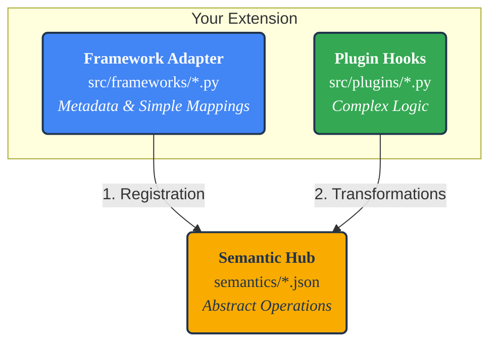

Extending
=========

**ml-switcheroo** is designed on a modular "Data-Driven" architecture. You can add support for new Machine Learning frameworks (like `tinygrad`, `keras`, or `mlx`) without modifying the core transpiler engine.

This happens by plugging a new "Spoke" into the central "Hub".

**Artifacts required for a new framework:**
1.  **Adapter**: Python class in `src/ml_switcheroo/frameworks/`.
2.  **Snapshot**: JSON mapping in `src/ml_switcheroo/snapshots/` (Auto-generated or Manual).

---

## 🏗️ Architecture Overview

The extension system works by injecting definitions into the Knowledge Base (The Hub).



---

## 1. Adding a Framework Adapter

To support a new library (e.g., `my_lib`), create a file `src/ml_switcheroo/frameworks/my_lib.py`.

The adapter class informs the engine how to import the library, where to look for layers, and how to map simple API calls.

```python
from typing import List, Tuple, Dict
from ml_switcheroo.frameworks.base import register_framework, FrameworkAdapter, StandardMap
from ml_switcheroo.semantics.schema import StructuralTraits

@register_framework("my_lib")  # Unique key for CLI
class MyLibAdapter:
    # --- 1. Metadata ---
    display_name = "My Library"
    
    # Optional: Inherit behavior (e.g. 'flax_nnx' inherits 'jax')
    inherits_from = None 
    ui_priority = 100

    # --- 2. Import Logic ---
    @property
    def import_alias(self) -> Tuple[str, str]:
        # How is the library imported at module level?
        # Output: import my_lib as ml
        return ("my_lib", "ml")

    @property
    def import_namespaces(self) -> Dict[str, Dict[str, str]]:
        # Map source namespaces to your framework
        # e.g. If input uses 'torch.nn', the transpiler should inject 'my_lib.layers' aliased as 'nn'
        return {
            "torch.nn": {"root": "my_lib", "sub": "layers", "alias": "nn"},
        }

    # --- 3. Static Mappings (The "Definitions") ---
    # Map Abstract Operations (Keys) to Concrete Implementations (Values)
    @property
    def definitions(self) -> Dict[str, StandardMap]:
        return {
            # Simple 1:1 Mapping
            # torch.abs(x) -> ml.abs(x)
            "Abs": StandardMap(api="ml.abs"),
            
            # Argument Renaming (Std Name -> Framework Name)
            # Abstract 'Linear' expects 'in' and 'out'. We map them to 'input_dim', 'units'.
            "Linear": StandardMap(
                api="ml.layers.Dense", 
                args={"in_features": "input_dim", "out_features": "units"}
            ),
            
            # Complex Logic via Plugin
            # Requires a hook defined in src/ml_switcheroo/plugins/
            "permute_dims": StandardMap(
                api="ml.transpose", 
                requires_plugin="pack_varargs"
            )
        }

    # --- 4. Structural Traits (Zero-Code Rewriting) ---
    # Configure how Classes and Functions are rewritten structurally
    @property
    def structural_traits(self) -> StructuralTraits:
        return StructuralTraits(
            module_base="ml.Module",         # Base class for layers
            forward_method="call",           # Method name (forward vs call vs __call__)
            requires_super_init=True,        # Inject super().__init__()?
            strip_magic_args=["rngs"],       # Remove args not used by this FW (e.g. from Flax)
            lifecycle_strip_methods=["to", "cpu"], # Methods to silently remove (e.g. .cuda())
        )
```

### Key Components

*   **`definitions`**: The primary way to define mappings. Mapping keys (e.g., `Abs`, `Linear`) must match the **Abstract Standard** defined in `semantics/*.json`.
*   **`import_namespaces`**: Configures the **Import Fixer**. It ensures that if the source code used `torch.nn`, the target code imports the equivalent module in your framework (e.g., `my_lib.layers`).

---

## 2. Structural Traits (Zero-Code Rewriting)

Different frameworks handle Classes and State differently. Instead of writing AST transformers, you simply configure the `StructuralTraits` object in your Adapter.

| Feature | PyTorch Config | JAX/Flax Config |
| :--- | :--- | :--- |
| **Base Class** | `module_base="torch.nn.Module"` | `module_base="flax.nnx.Module"` |
| **Inference Method** | `forward_method="forward"` | `forward_method="__call__"` |
| **Constructor** | `requires_super_init=True` | `requires_super_init=False` |
| **RNG State** | `inject_magic_args=[]` | `inject_magic_args=[("rngs", "nnx.Rngs")]` |
| **Lifecycle** | `lifecycle_strip_methods=["to"]` | (N/A - functional) |

The engine reads these traits to automatically:
*   Rename methods (e.g., `forward` $\to$ `__call__`).
*   Inject arguments (e.g., adding `rngs` to `__init__`).
*   Clean up imperative calls (e.g., removing `.to(device)`).

---

## 3. Plugin System (Custom Hooks)

For operations that require structural reshaping (e.g., converting `x.view(a,b)` to `reshape(x, (a,b))`), you write a **Plugin**.

### Defining a Plugin

Create a file in `src/ml_switcheroo/plugins/`. It will be auto-loaded.

```python
import libcst as cst
from ml_switcheroo.core.hooks import register_hook, HookContext

@register_hook("my_custom_reshape")
def transform_reshape(node: cst.Call, ctx: HookContext) -> cst.Call:
    # 1. Inspect the 'node' (The function call)
    # 2. Use 'ctx' to check config or lookup mappings
    # 3. Return a new CST node
    
    # Example: Rename function to 'reshape'
    return node.with_changes(func=cst.Name("reshape"))
```

### Linking the Plugin

In your Adapter's `definitions`, link the abstract operation to your hook string:

```python
"Reshape": StandardMap(
    api="my_lib.reshape", 
    requires_plugin="my_custom_reshape"
)
```

### Common Built-in Hooks

The core engine provides several reusable hooks in `src/ml_switcheroo/plugins/` you can link to immediately:
*   `pack_varargs`: Converts positional varargs `(x, 1, 2)` to a tuple `(x, axis=(1, 2))`.
*   `method_to_property`: Converts method calls `x.size()` to properties `x.shape`.
*   `context_to_function_wrap`: Converts context managers `with no_grad():` to `with nullcontext():`.

---

## 4. Automated Discovery (Optional)

If your framework has hundreds of functions, manual mapping is tedious. You can use the **Scaffolder** to auto-generate mappings in JSON format.

1.  **Install your library**: `pip install my_lib`
2.  **Define Heuristics**: In your Adapter, add regex patterns to guide the scanner.
    ```python
    @property
    def discovery_heuristics(self):
        return {
            "neural": [r"\.layers\.", r"Layer$"], # Classes ending in Layer -> Neural
            "extras": [r"\.io\.", r"save", r"load"] # IO -> Extras
        }
    ```
3.  **Run Scaffolder**:
    ```bash
    ml_switcheroo scaffold --frameworks my_lib
    ```

This generates `src/ml_switcheroo/snapshots/my_lib_v1.0_map.json`. The engine loads *both* the static `definitions` from your Python class AND these JSON snapshots at runtime.

---

## 5. Verification

Determine if your mappings are mathematically correct using the built-in Fuzzer.

1.  **Define Test Config**: In your Adapter, tell the test generator how to create tensors.
    ```python
    @property
    def test_config(self) -> Dict[str, str]:
        return {
            "import": "import my_lib as ml",
            "convert_input": "ml.array({np_var})", # {np_var} is a numpy array
            "to_numpy": "np.array({res_var})"      # Convert back to numpy
        }
    ```

2.  **Run CI**:
    ```bash
    ml_switcheroo ci
    ```
    This generates random inputs (based on type hints in the Spec), runs `my_lib.op(inputs)`, and compares the result against the reference implementation (usually PyTorch or NumPy).
