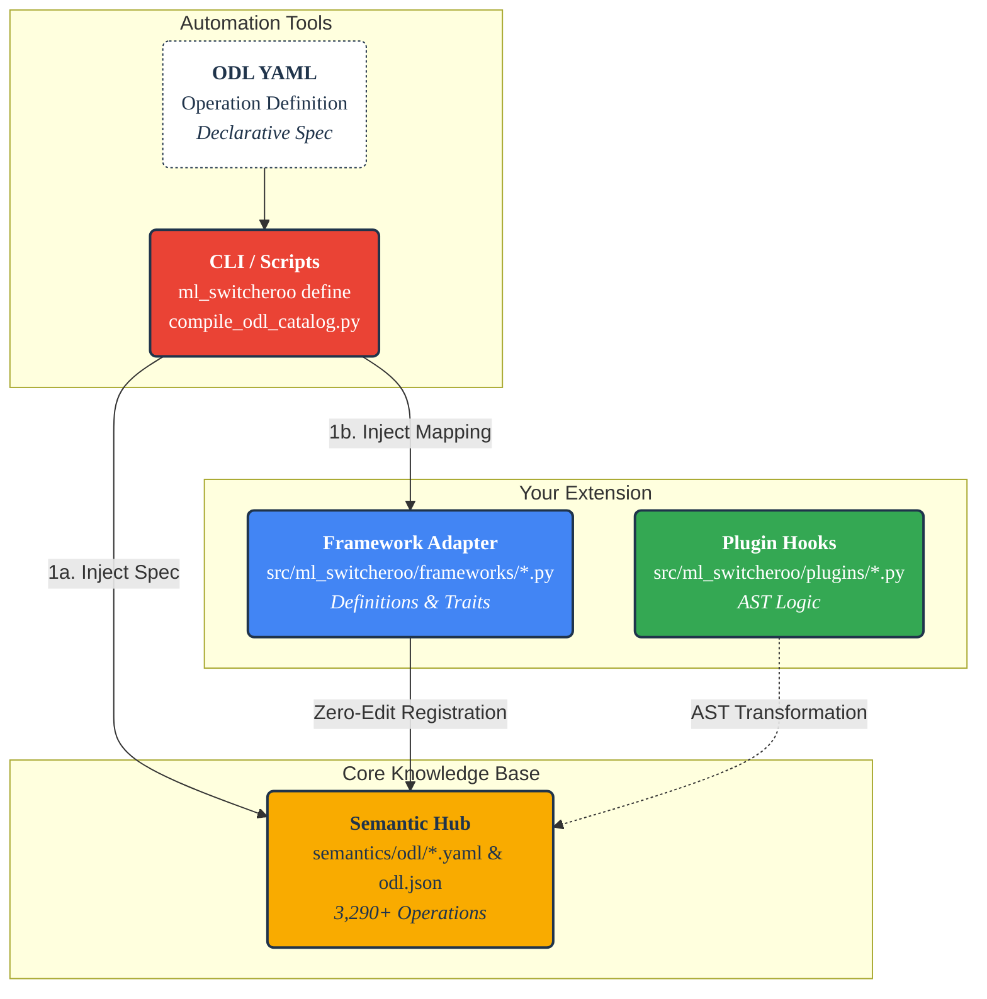

Extending
=========

**ml-switcheroo** is built on a modular, data-driven architecture.

There are three ways to extend the system, ordered by complexity:

1. **ODL (Operation Definition Language)**: Declaratively define operations using YAML or `StandardMap` objects. This handles 90% of cases (renaming, reordering, packing args, macros). **[See: [EXTENDING_WITH_DSL](EXTENDING_WITH_DSL.md)]**
    * Author discrete operation YAMLs: `src/ml_switcheroo/semantics/odl/{Operation}.yaml`
    * Compile into the centralized catalog: `src/ml_switcheroo/semantics/odl.json` via `python3 scripts/compile_odl_catalog.py`
2. **Adapter API**: Write Python classes to support entirely new frameworks or hardware dialects (e.g. adding `TinyGrad` or custom ISAs).
3. **Plugin Hooks**: Write AST transformation logic for complex architectural mismatches that declarative ODL cannot express (e.g., state injection, PRNG threading, context manager rewriting).

This document covers **2** and **3**.

---

## 🏗️ Architecture Overview

The extension system injects definitions into the Knowledge Base (The Hub) and links them to specific framework implementations (The Spokes).


```mermaid
graph TD
    %% --- STYLE DEFINITIONS ---
    classDef default font-family:'Google Sans Normal',color:#20344b,stroke:#20344b;
    classDef hub fill:#f9ab00,stroke:#20344b,stroke-width:2px,color:#20344b,font-family:'Google Sans Medium',rx:5px;
    classDef adapter fill:#4285f4,stroke:#20344b,stroke-width:2px,color:#ffffff,font-family:'Google Sans Medium',rx:5px;
    classDef plugin fill:#34a853,stroke:#20344b,stroke-width:2px,color:#ffffff,font-family:'Google Sans Medium',rx:5px;
    classDef tool fill:#ea4335,stroke:#20344b,stroke-width:2px,color:#ffffff,font-family:'Google Sans Medium',rx:5px;
    classDef input fill:#ffffff,stroke:#20344b,stroke-width:1px,color:#20344b,font-family:'Roboto Mono Normal',stroke-dasharray: 2 2;

    subgraph "Your Extension"
        direction TB
        ADAPTER("<b>Framework Adapter</b><br/>src/ml_switcheroo/frameworks/*.py<br/><i>Definitions & Traits</i>"):::adapter
        PLUGIN("<b>Plugin Hooks</b><br/>src/ml_switcheroo/plugins/*.py<br/><i>AST Logic</i>"):::plugin
    end

    subgraph "Core Knowledge Base"
        direction TB
        HUB("<b>Semantic Hub</b><br/>semantics/odl/*.yaml & odl.json<br/><i>3,290+ Operations</i>"):::hub
    end

    subgraph "Automation Tools"
        direction TB
        DEFINE("<b>CLI / Scripts</b><br/>ml_switcheroo define<br/>compile_odl_catalog.py"):::tool
        YAML("<b>ODL YAML</b><br/>Operation Definition<br/><i>Declarative Spec</i>"):::input
    end

    %% Wiring
    YAML --> DEFINE
    DEFINE -->|" 1a. Inject Spec "| HUB
    DEFINE -->|" 1b. Inject Mapping "| ADAPTER
    ADAPTER -->|" Zero-Edit Registration "| HUB
    PLUGIN -.->|" AST Transformation "| HUB
```

---

## 🔌 2. Adding a Framework Adapter

To support a new library (e.g., `tinygrad`, `custom_engine`), create a Python class that acts as the translation interface. It converts the library's specific idioms into traits understood by the core engine.

Adapters feature **Zero-Edit Registration**: simply placing an adapter module decorated with `@register_framework` inside `src/ml_switcheroo/frameworks/` automatically registers it across all CLI commands (`convert`, `matrix`, `gen-docs`).

**Location:** `src/ml_switcheroo/frameworks/{my_lib}.py`

```python
from typing import Dict, Tuple, List, Set, Any
from ml_switcheroo.frameworks.base import register_framework, FrameworkAdapter, StandardMap, ImportConfig
from ml_switcheroo.semantics.schema import StructuralTraits, PluginTraits
from ml_switcheroo.enums import SemanticTier


@register_framework("my_lib")
class MyLibAdapter:
  display_name = "My Library"

  # Optional: Inherit implementation behavior (e.g., 'flax_nnx' inherits 'jax' math)
  inherits_from = None

  # Discovery configuration
  ui_priority = 100

  # --- 1. Import Logic ---
  @property
  def import_alias(self) -> Tuple[str, str]:
    # How is the library imported? (Package Name, Common Alias)
    return ("my_lib", "ml")

  @property
  def import_namespaces(self) -> Dict[str, ImportConfig]:
    # Declare namespaces for the Import Fixer
    return {
      "my_lib": ImportConfig(tier=SemanticTier.ARRAY_API, recommended_alias="ml"),
      "my_lib.layers": ImportConfig(tier=SemanticTier.NEURAL, recommended_alias="layers"),
    }

  # --- 2. Static Mappings (The "Definitions") ---
  # Allows Ghost Mode to function without the target library installed locally.
  @property
  def definitions(self) -> Dict[str, StandardMap]:
    return {
      # Simple 1:1 Mapping
      "Abs": StandardMap(api="ml.abs"),
      # Argument Renaming
      "Linear": StandardMap(api="ml.layers.Dense", args={"in_features": "input_dim", "out_features": "units"}),
      # DSL Feature: Argument Packing (Variadic -> Tuple)
      "permute_dims": StandardMap(api="ml.transpose", pack_to_tuple="axes"),
      # DSL Feature: Inline Macro
      "SiLU": StandardMap(macro_template="{x} * ml.sigmoid({x})"),
      # Linking to a Custom Plugin (Logic located in src/ml_switcheroo/plugins/)
      "SpecialOp": StandardMap(requires_plugin="my_custom_logic"),
    }

  # --- 3. Structural Traits ---
  # Configure how Classes/Functions are rewritten without custom code
  @property
  def structural_traits(self) -> StructuralTraits:
    return StructuralTraits(
      module_base="ml.Module",  # Base class for layers
      forward_method="call",  # Inference method name
      requires_super_init=True,  # Inject super().__init__()?
      inject_magic_args=[],  # Special signature arguments (e.g. [("rngs", "nnx.Rngs")])
      lifecycle_strip_methods=["gpu"],  # Methods to silently remove
      impurity_methods=["add_"],  # Methods flagged as side-effects
    )

  # --- 4. Plugin Traits ---
  # Configure how generic plugins interact with this framework
  @property
  def plugin_traits(self) -> PluginTraits:
    return PluginTraits(
      has_numpy_compatible_arrays=True,  # Supports .astype() casting?
      requires_explicit_rng=False,  # Requires JAX-style keys?
      requires_functional_state=False,  # Requires BatchNorm unrolling?
      requires_functional_control_flow=False,  # Requires loop unrolling?
      enforce_purity_analysis=False,  # Run PurityScanner before transpilation?
    )

  @property
  def supported_tiers(self) -> List[SemanticTier]:
    return [SemanticTier.ARRAY_API, SemanticTier.NEURAL]
```

---

## 🧠 3. Plugin System (Custom Code)

For operations that require manipulating the AST structure (e.g., injecting imports, wrapping contexts, unwrapping state, or threading PRNG keys), use the **Hook System**.

Create a Python file in `src/ml_switcheroo/plugins/`. It is discovered and loaded automatically by the plugin registry.

### Anatomy of a Plugin

Plugins are functions decorated with `@register_hook`. They receive the current AST node and a `HookContext` object.

```python
import libcst as cst
from ml_switcheroo.core.hooks import register_hook, HookContext


@register_hook("my_custom_logic")
def transform_special_op(node: cst.Call, ctx: HookContext) -> cst.CSTNode:
  """Example: Transforms `special_op(x)` into `context_wrapper(x)`."""
  # 1. Inspect Context
  if not ctx.plugin_traits.has_numpy_compatible_arrays:
    return node

  # Look up API path dynamically from the Hub (Decoupled from hardcoded strings)
  target_api = ctx.lookup_api("SpecialOp") or "default.op"

  # 2. Inject Dependencies (Preamble / Module Header)
  if not ctx.metadata.get("my_helper_injected"):
    ctx.inject_preamble("import my_helper_lib")
    ctx.metadata["my_helper_injected"] = True

  # 3. Modify AST
  return node
```

### The Hook Context (`ctx`)

The `HookContext` provides helper methods for writing framework-agnostic plugins:

* `ctx.target_fw`: The active target framework key (e.g. `"jax"`, `"flax_nnx"`, `"mlx"`).
* `ctx.plugin_traits`: A `PluginTraits` object describing the target (e.g., `requires_explicit_rng`). Prefer checking traits over checking framework strings.
* `ctx.lookup_api(op_name)`: Resolve the API string for the current target via the Semantics Manager.
* `ctx.inject_signature_arg(name, type_hint)`: Add an argument to the enclosing function definition (e.g., inject `rng` into `def forward(...)`).
* `ctx.inject_preamble(code)`: Add code to the start of the function body or module header.
* `ctx.current_variant`: Access the active `FrameworkVariant` definition from ODL to read custom metadata (e.g. `args` map).
* `ctx.resolve_type(node)`: Query the pre-calculated `SymbolTable` to determine if a node represents a `"Tensor"` or `"Module"`.

### Auto-Wired Plugins

You can register a hook and declare its semantic Hub mapping in a single location using the `auto_wire` parameter. This pattern guarantees locality of behavior.

```python
@register_hook(
  trigger="custom_reshape",
  auto_wire={
    "ops": {
      "Reshape": {
        "std_args": ["x", "shape"],
        "variants": {"torch": {"api": "torch.reshape"}, "jax": {"requires_plugin": "custom_reshape"}},
      }
    }
  },
)
def transform_reshape(node: cst.Call, ctx: HookContext) -> cst.Call:
  # Plugin AST transformation logic...
  return node
```
