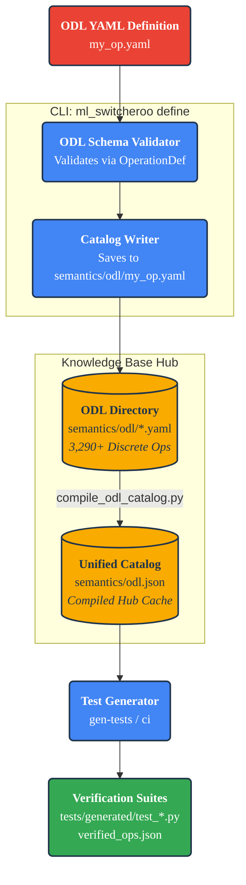

Extending with DSL
==================

The **Operation Definition Language (ODL)** is a declarative YAML schema used to teach `ml-switcheroo` new mathematical and neural operations. It serves as the "DNA" of the compiler, defining:

1. **Semantic Interface**: Arguments, Types, Ranks, Shapes, and Bounds.
2. **Implementation Logic**: How to map the operation to specific backends (PyTorch, JAX, Apple MLX, Keras 3, AMD RDNA, NVIDIA SASS).
3. **Verification Data**: Constraints and hints for the automated hypothesis fuzzer to mathematically prove equivalence.

ODL allows you to inject operations and mappings into the **Knowledge Base** without writing procedural AST transformation code.

---

## 🏗️ The ODL Lifecycle

Data flows from discrete YAML files into the Knowledge Base (The Hub), which are compiled into a deterministic runtime catalog and used to generate verification harnesses.



---

## 🤖 LLM-Assisted Workflow (The Fast Cycle)

Authoring YAML manually is slow. `ml-switcheroo` provides tools to put an LLM "in the loop" for rapid, verified operation coverage.

### 1. Identify Unmapped APIs

Audit your model dependencies or compare against live framework snapshots:

```bash
# Audit all ODL definitions against extracted framework snapshots
python3 scripts/audit_against_snapshots.py
```

### 2. Generate Prompt Context (`suggest`)

The `suggest` command introspects the installed source library and generates a pre-filled prompt for an LLM containing:
* **Signatures & Docstrings**: Extracted via runtime reflection.
* **ODL Schema Constraints**: The formal schema requirements.
* **Baseline Mapping Example**: A structured template.

```bash
# Generate prompt for a specific API
ml_switcheroo suggest 'torch.nn.functional.grid_sample' > prompt.md

# Batch-suggest entire namespaces to an output directory
ml_switcheroo suggest 'torch.nn.functional' --out-dir ./prompts/ --batch-size 20
```

**Automated Loop:** Use `scripts/suggest_gen_llm_loop.sh` to automate batch prompt building and iterative code generation across missing operations.

```bash
./scripts/suggest_gen_llm_loop.sh
```

### 3. Schema Export (`schema`)

Export the official ODL JSON schema to configure custom LLM tool-calling or IDE validation:

```bash
ml_switcheroo schema > odl_schema.json
```

### 4. Inject Definition (`define`)

The `define` command validates the YAML file against the Pydantic `OperationDef` schema before writing to disk. If the schema is invalid, it logs the validation error and aborts without altering files:

```bash
ml_switcheroo define my_op.yaml
```

### 5. Recompile Catalog & Verify

Once definitions are injected into `src/ml_switcheroo/semantics/odl/`, compile the runtime catalog and run verification:

```bash
# 1. Compile all discrete YAML definitions into semantics/odl.json
python3 scripts/compile_odl_catalog.py

# 2. Validate catalog integrity
python3 scripts/validate_odl_json.py

# 3. Run property-based verification on the new operation
ml_switcheroo ci --json-report verified_ops.json
```

---

## 📚 The Schema at a Glance

A complete ODL definition looks like this:

```yaml
operation: "LogSoftmax"
description: "Applies the LogSoftmax function to an n-dimensional input Tensor."
op_type: "function" # function | context | decorator | attribute | class | macro_graph

# 1. Standard Arguments (The Abstract Signature)
std_args:
  - name: "input"
    type: "Tensor"
    rank: 4                    # Constraint: Must be 4D (e.g. NCHW)
    dtype: "float32"           # Constraint: Input must be float32
    shape_spec: "[B, C, H, W]" # Symbolic shape hint for Fuzzer

  - name: "dim"
    type: "int"
    default: -1                # Default value if missing in source
    min: -4
    max: 3

# 2. Return Verification
return_type: "Tensor"
output_shape_calc: "lambda input, dim: input.shape" # Verifies output shape matches input

# 3. Framework & Hardware Implementations
variants:
  torch:
    api: "torch.nn.functional.log_softmax"

  jax:
    api: "jax.nn.log_softmax"
    args:
      dim: "axis"              # Rename 'dim' -> 'axis'
    min_version: "0.4.0"
    required_imports:
      - "import jax.nn"

  mlx:
    api: "mlx.core.log_softmax"
    args:
      dim: "axis"

  nvidia_sass:
    api: "; Macro.LogSoftmax"

  rdna:
    api: "; Macro.LogSoftmax"
```

To install this definition:

```bash
ml_switcheroo define my_op.yaml
python3 scripts/compile_odl_catalog.py
```

---

## 🧬 Feature Reference

### 1. Argument Normalization & Pivoting

The core job of ODL is pivoting arguments from **Source Names** to **Standard Names**, and then to **Target Names**.

```yaml
std_args:
  - name: "x"
  - name: "axis"
  - name: "keepdims"
    default: false
variants:
  torch:
    api: "torch.sum"
    args:
      axis: "dim"          # Map Spec 'axis' -> Torch 'dim'
      keepdims: "keepdim"  # Map Spec 'keepdims' -> Torch 'keepdim'
  jax:
    api: "jnp.sum"
    # JAX matches standard names, no mapping needed
```

### 2. Rich Parameter Constraints (Fuzzer Control)

You can attach metadata to `std_args` to constrain the inputs generated during property-based fuzzing (`ci`) or strict-mode checking.

| Field | Description | Example |
| :--- | :--- | :--- |
| `name` | Standard argument name. | `"dim"` |
| `type` | Python Type Hint string. | `"int"`, `"Tensor"`, `"List[int]"` |
| `default` | Default value (injected if missing). | `-1`, `1e-5`, `True`, `None` |
| `rank` | Required tensor rank (number of dimensions). | `4` |
| `dtype` | Required data type. | `"float32"`, `"int64"`, `"bool"` |
| `shape_spec` | Symbolic shape string indicating dimension constraints. | `"[B, T, D]"`, `"[N, N]"` |
| `min` / `max` | Numeric bounds for scalar generation. | `min: 0`, `max: 1` |
| `options` | Allowed discrete values (Enumeration). | `["sum", "mean", "none"]` |
| `is_variadic` | If `true`, accepts `*args`. | `true` |
| `kind` | Parameter kind convention. | `"positional_only"`, `"keyword_only"` |

### 3. Conditional Dispatch (Runtime Rules)

When a target framework uses different APIs based on parameter values, use **Dispatch Rules** to dynamically switch the target API.

**Supported Operators (`LogicOp`):** `eq`, `neq`, `gt`, `lt`, `gte`, `lte`, `in`, `not_in`, `is_type`.

```yaml
operation: "Resize"
std_args:
  - name: "image"
  - name: "mode"
variants:
  jax:
    api: "jax.image.resize" # Default API
    dispatch_rules:
      # If mode == 'nearest', swap function
      - if_arg: "mode"
        op: "eq"
        val: "nearest"
        use_api: "jax.image.resize_nearest"

      # If input is a List, use batch processor
      - if_arg: "image"
        op: "is_type"
        val: "list"
        use_api: "jax.image.resize_batch"
```

### 4. Argument Value Mapping (Enum Translation)

Translate string literals or enum values between frameworks.

```yaml
operation: "Reduce"
std_args:
  - name: "x"
  - name: "reduction"
variants:
  torch:
    api: "torch.reduce"
    arg_values:
      reduction:
        mean: "'avg'"
        sum: "'add'"
```

### 5. Output Adaptation (Selection & Casting)

Handle differences in return signatures:
* **Selection (`output_select_index`)**: If the source returns a tuple `(val, idx)` but the target only returns `val`.
* **Casting (`output_cast`)**: If the target returns `float32` but the specification requires `int64`.

```yaml
variants:
  jax:
    api: "jnp.max_indices"
    output_select_index: 0
    output_cast: "jnp.int64"
```

### 6. Tensor Layout Permutation

Automatically inject dimension permutation (`transpose` / `permute`) calls to align memory layouts (e.g. NCHW vs NHWC).

```yaml
operation: "Conv2d"
variants:
  jax:
    api: "jax.lax.conv"
    # Syntax: SOURCE_LAYOUT -> TARGET_LAYOUT
    layout_map:
      input: "NCHW->NHWC"
      weight: "OIHW->HWIO"
      return: "NHWC->NCHW"
```

### 7. Argument Packing & Variadics

Convert variadic parameters (`func(*args)`) into container arguments (`func(inputs=[...])`).

```yaml
std_args:
  - name: "tensors"
    is_variadic: true
variants:
  keras:
    api: "keras.layers.Add"
    pack_as: "List" # Packs *tensors into a list and passes to pos 0
```

### 8. Inline Macros

For operations that lack a direct single-kernel equivalent in the target framework, define inline string macro templates:

```yaml
operation: "SiLU"
std_args:
  - name: "x"
variants:
  my_lib:
    macro_template: "{x} * my_lib.sigmoid({x})"
```

---

## 🔌 Advanced Configuration

### Version Constraints

Prevent invalid code generation if the target environment is outside supported version boundaries:

```yaml
variants:
  jax:
    api: "jax.scipy.special.logits"
    min_version: "0.4.0"
    max_version: "0.5.0"
```

### Dependency Management

Inject imports required by your mapping. The `ImportFixer` places these at the module top and deduplicates them:

```yaml
variants:
  numpy:
    api: "np.sigmoid"
    required_imports:
      - "import numpy as np"
      - module: "scipy.special"
        alias: "sp"
```

### Plugin Scaffolding

If an operation requires custom AST manipulation, link it to a plugin hook:

```yaml
operation: "ComplexOp"
variants:
  jax:
    requires_plugin: "my_complex_logic"

scaffold_plugins:
  - name: "my_complex_logic"
    type: "call_transform"
    doc: "Handles complex transformation for JAX."
    rules:
      - if_arg: "x"
        op: "eq"
        val: 0
        use_api: "jax.zeros_like"
```

---

## 🧪 Verification Logic

The `ci` and `gen-tests` commands use the metadata in your ODL to create and run equivalence verification:

* `test_rtol` / `test_atol`: Set numerical tolerances for floating-point checks.
* `nondeterministic`: Set to `true` to relax checks for random/stochastic operations.
* `verification_mode`: Set to `"exact"` for strict integer/boolean comparisons, or `"approx"` (default) for floating point checks.
* `output_shape_calc`: A Python lambda string to mathematically assert that the output shape matches expectations:
  ```yaml
  output_shape_calc: "lambda input, dim: input.shape[:-1]"
  ```
