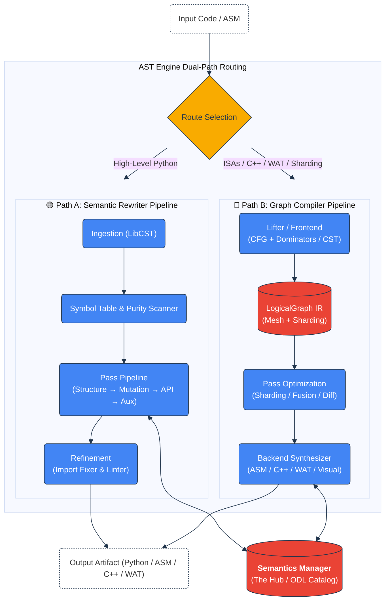

Internal Architecture & Theoretical Mechanics
=============================================

**Document Version**: 0.0.2

**Scope**: Core Engine, Compiler Mechanics, IR Design, Knowledge Acquisition, and Hardware Bridges.

## 1. Abstract

`ml-switcheroo` is a deterministic, specification-driven universal compiler architecture. Unlike traditional
transpilers that map syntax 1:1, it employs a **Hub-and-Spoke** semantic model to solve the $O(N^2)$ interoperability
problem.

The system treats every deep learning representation—whether high-level Python (PyTorch, JAX/Flax NNX, Apple MLX, Keras 3),
intermediate representation (StableHLO, MLIR, ML-Switcheroo IR), native C++ PyBind11 extensions, WebAssembly (WAT),
or hardware assembly (NVIDIA SASS, AMD RDNA)—as a dialect of a central mathematical logic.

The runtime engine uses a **Dual-Pipeline Strategy** to handle the distinct topological requirements of structured
code (ASTs) versus linear instruction streams (Graphs/ASM).

---

## 2. The Grand Unified Architecture

The `ASTEngine` (`src/ml_switcheroo/core/engine.py`) is the central orchestration unit. Upon receiving source code, it
classifies the Input/Output languages to route execution through one of two isomorphic pipelines.

### 2.0. Route Selection Logic

The Engine dynamically decides between the **Rewriter Pipeline** (Path A) and the **Compiler Pipeline** (Path B) based on:
1. **Source Nature**: Linear machine instruction streams (NVIDIA SASS, AMD RDNA) or serialized IR graphs are parsed directly into `LogicalGraph`. High-level structured Python source defaults to the Rewriter Pipeline.
2. **Target Nature**: If the target requires holistic layout logic (HTML, TikZ, LaTeX), machine assembly (SASS, RDNA), native C++ extensions, or WebAssembly (WAT), execution routes into Path B.
3. **Distributed Sharding & IR Roundtrips**: When distributed sharding semantics (`--sharding`) are requested on Python code, or when forced roundtrips through intermediate representations (`--intermediate ir`) occur, the code is lifted into `LogicalGraph` for graph-level optimization before code emission.
4. **Graph-Guided Rewriting (The Loopback Bridge)**: For architectural optimizations across Python dialects (e.g., fusing a Conv2d and a BatchNorm2d natively), the Rewriter Pipeline can perform a loopback: lifting an AST snippet into a `LogicalGraph`, running optimization passes (fusion, parameter folding), and synthesizing it back into AST nodes.

### 2.1. Path A: The High-Fidelity Rewriter

**Used for:** Source-to-source Python $\leftrightarrow$ Python transpilation (PyTorch, JAX, MLX, Keras 3, TensorFlow).

This path treats code as a mutable, structured document. The primary mandate is **high-fidelity preservation**: comments, whitespace, variable naming conventions, and local stylistic patterns are preserved where possible.

* **Intermediate Representation:** Concrete Syntax Tree (LibCST).
* **Mechanism:** A pipeline of visitor passes modifies the tree in-place, guided by the Semantic Knowledge Base and Framework Traits.

### 2.2. Path B: The Graph Compiler

**Used for:** Hardware Assembly (NVIDIA SASS, AMD RDNA), Native C++ PyBind11 extensions, WebAssembly (WAT), Visuals (TikZ, HTML), and distributed sharding.

This path treats code as a reconstructible computation flow graph. It lifts linear instruction streams or high-level code into a topological DAG (`LogicalGraph`), runs whole-graph optimizations, and synthesizes clean target code or hardware instruction kernels.

* **Intermediate Representation:** `LogicalGraph` (DAG with `LogicalMesh` and `PartitionSpec`).
* **Mechanism:** Parsers and Lifters convert text into graph topologies; Backends synthesize target machine code or native syntax from the graph.

---

## 3. The Knowledge Base (The Hub)

The system intelligence resides in `src/ml_switcheroo/semantics/`. It decouples **Specification** (What) from **Implementation** (How).

### 3.1. Distributed Specifications & ODL Catalog

The knowledge base is an aggregate view composed of:

1. **Operation Definition Language (ODL)**: 3,291 discrete, atomic YAML files located in `src/ml_switcheroo/semantics/odl/`, compiled deterministically into `src/ml_switcheroo/semantics/odl.json`.
2. **Hardware ISA Specifications**: Declarative instruction schemas for NVIDIA SASS (`nvidia_sass_isa.yaml`) and AMD RDNA (`rdna_isa.yaml`).
3. **Framework Snapshots (`snapshots/`)**: JSON overlays defining live and offline framework signatures (sourced from `ml-framework-snapshots` and `ml-compiler-snapshots`).
4. **Framework Adapters (`src/ml_switcheroo/frameworks/`)**: Python classes that expose structural and plugin traits.

The `KnowledgeBaseLoader` loads operations using a prioritized hierarchy:
* **Priority 10**: Array API (pure math operators).
* **Priority 20**: Neural Net operators (stateful layers, activations, loss functions).
* **Priority 30**: Discovered definitions and framework extras.

### 3.2. Lifecycle: Discovery, Consensus & Quarantine

New knowledge is acquired through the **Discovery** subsystem:

1. **Inspection (`ApiInspector`)**: Scans installed libraries or JSON snapshots (`GhostRef`).
2. **Consensus (`ConsensusEngine`)**: Clusters APIs from different frameworks (e.g., grouping `HuberLoss`, `huber_loss`) to propose new standard operations.
3. **Quarantine (`quarantine.yaml`)**: Isolates non-standard, unverified, or ambiguous operations until test suites and formal specifications validate their mathematical constraints.
4. **Persistence (`compile_odl_catalog.py`)**: Validates YAML schemas against `SemanticsFile` and serializes the unified `odl.json` catalog.

---

## 4. Path A: The Rewriter Pipeline

Implemented in `src/ml_switcheroo/core/rewriter/`.

The transformation is orchestrated by a `RewriterPipeline` (`src/ml_switcheroo/core/rewriter/pipeline.py`) executing sequential passes over a shared `RewriterContext`.

### 4.1. Core Passes

1. **`StructuralPass`**: Rewrites class declarations, layer base classes (`nn.Module` $\to$ `nnx.Module`), inference method names (`forward` $\to$ `__call__`), and injects lifecycle arguments (`rngs: nnx.Rngs`).
2. **`FunctionalMutationPass`**: Detects imperative, in-place tensor mutations (`x += y`, `x[idx] = val`, `.add_()`) and desugars them into pure functional assignments (e.g., `x = x.at[idx].set(val)`), satisfying pure-function constraints for targets like JAX.
3. **`ApiPass`**: The primary operator transformer:
    * **Dispatch Rules**: Runtime evaluations of argument values to conditionally swap APIs (e.g., `mode='nearest'`).
    * **Argument Pivoting**: Renames, reorders, and normalizes positional-to-keyword arguments to match the Abstract Hub.
    * **Strategy Execution**: Applies transforms including inline macros, layout permutations (`NCHW` $\leftrightarrow$ `NHWC`), and infix operator swaps.
4. **`AuxiliaryPass`**: Handles decorators (`@torch.no_grad()` $\to$ `@jax.jit`), control-flow safety checks, and loop unrolling warnings.

### 4.2. Plugin System & Hooks (`src/ml_switcheroo/plugins/`)

Complex architectural mismatches are handled by 35+ registered plugins:
* **Distributed**: `auto_fsdp_wrapper` (graph-level sharding passes reside in `core/compiler/sharding.py`).
* **State & Lifecycle**: `rng_threading`, `state_container`, `state_flag_injection`, `device_allocator`, `device_checks`.
* **Tensor Layout & Operations**: `attention_packing`, `shape_packing`, `einsum`, `gather`, `scatter`, `padding`, `reshape`, `flatten`, `topk`, `in_top_k_plugin`, `batch_norm`.
* **Training & Schedulers**: `optimizer_step`, `schedulers`, `clipping`, `loss_wrapper`, `checkpoint_keys`.
* **Control Flow**: `inplace_unroll`, `loop_unroll`, `static_unroll`, `context_to_function_wrap`.
* **Framework Specializations**: `mlx_optimizers`, `mlx_extras`, `nnx_to_torch_params`, `jax_decompose`, `keras_sequential`, `tf_data_loader`, `data_loader`.

Plugins use `@register_hook("trigger")` and receive a `HookContext` granting access to symbol tables, target traits, and AST context.

### 4.3. Import Fixer

A post-processing engine in `src/ml_switcheroo/core/import_fixer/`. It builds and applies a `ResolutionPlan`:
* **Injection**: Injects target framework imports (`import jax.numpy as jnp`, `from flax import nnx`) only when referenced.
* **Pruning**: Removes unused source imports (`import torch`).
* **Refinement**: Simplifies fully qualified symbols (`jax.numpy.abs` $\to$ `jnp.abs`) and resolves alias collisions.

---

## 5. Path B: The Graph Compiler

Implemented in `src/ml_switcheroo/core/compiler/`.

### 5.1. Intermediate Representation (IR)

The `LogicalGraph` (`ml_switcheroo_ir`) serves as the universal compiler intermediate representation:

* **`LogicalNode`**: Represents an operation (e.g., `Conv2d`, `Linear`, `SwiGLU`). Stores input variables, output variable IDs, and attribute dictionaries.
* **`LogicalEdge`**: Represents explicit data flow and dependency edges between node outputs and inputs.
* **`LogicalMesh` & `PartitionSpec`**: Models multidimensional device meshes and tensor/FSDP sharding axes.

### 5.2. Frontends & Lifters

* **Hardware Lifters (`NvidiaSassLifter`, `RdnaLifter`)**: Parses raw machine instruction streams. Uses Control Flow Graph (CFG) analysis (`src/ml_switcheroo/analysis/cfg.py`) and Dominator Trees (`src/ml_switcheroo/analysis/dominators.py`) to isolate basic blocks, detect natural loops, and reconstruct kernel parameters.
* **Python Frontend & `SemanticParser`**: Parses LibCST nodes into `LogicalGraph` using ODL signatures and symbol provenance.
* **IR Frontend**: Ingests serialized `ml_switcheroo_ir` JSON graphs directly.

### 5.3. Backends (Synthesizers)

* **Hardware Emitters**: `NvidiaSassBackend` and `RdnaBackend` synthesize macro streams into valid machine instruction code.
* **C++ Backend**: `TorchCppExtensionGenerator` compiles logical graphs into native PyTorch C++ extensions with PyBind11 bindings via a dedicated Lark C++ parser and transformer.
* **WebAssembly Backend**: `WasmBackend` generates valid WebAssembly Text (`WatModule`, `WatFunc`, `WatInstr`).
* **Visual Backends (`tikz`, `html`, `latex`)**: Calculates topological rank-based layouts for publication-ready LaTeX TikZ diagrams and responsive HTML Grid CSS architectures.
* **Python Code Backends**: Reconstructs complete framework classes (`nn.Module`, `nnx.Module`) and forward functions.

### 5.4. Graph Optimization & Fusion Passes

* **`ShardingInferencePass`**: Infers distributed parallel annotations for unannotated graphs.
* **`QKVFusionPass` / `QKVDefusionPass`**: Fuses or splits Transformer attention projections (`q_proj`, `k_proj`, `v_proj`).
* **`SwiGLUFusionPass` / `SwiGLUDefusionPass`**: Fuses separate `gate_proj` and `up_proj` linear layers into unified `SwiGLU` nodes for LLMs (Qwen).
* **`VisionPatchEmbeddingFusionPass` / `VisionPatchEmbeddingDefusionPass`**: Restructures and lowers patch embeddings for multimodal vision-language models.
* **`GraphDiffer`**: Computes minimal topological diffs (`DeleteAction`, `ReplaceAction`) between source and target computation graphs.

---

## 6. Verification & Fuzzing

Fidelity is ensured via `src/ml_switcheroo/testing/`.

### 6.1. The Harness Generator & BatchValidator

* **`HarnessGenerator`**: Generates standalone Python verification scripts that run `source(x) == target(x)` across live engines.
* **`BatchValidator`**: Automates batch execution across all mapped operations in the Knowledge Base.
* **`SemanticsBisector`**: Powers the `--repair` flag in the `ci` CLI command. When hypothesis tests fail, it performs binary search / bisection over tolerance thresholds to automatically propose and persist relaxed numerical constraints.

### 6.2. Input Fuzzer & Static Safety

* **Input Fuzzer**: Uses `Hypothesis` strategies derived from ODL type hints, generating tensors with symbolic shapes (e.g., `Array['B', 'N']`) and respecting constraints (`min`, `max`, `dtype`).
* **`PurityScanner`**: Statically analyzes code for impure state, in-place modifications, and global side-effects.
* **`StaticSafetyAnalyzer`**: Evaluates data types, shape dimension matching, and device allocation safety across framework boundaries.

---

## 7. Extensions: MLIR & StableHLO

`ml-switcheroo` bridges Python and Textual IRs.

* **MLIR Bridge**: Ingests and emits MLIR text while preserving comments, dialect syntax, and whitespace trivia.
* **StableHLO Dialect**: Handled via `StableHloEmitter` and `importers/stablehlo_reader.py`, translating between Python ASTs, `LogicalGraph`, and `stablehlo.*` dialect operations for XLA compilation.

---

## 8. Weight Migration Support

Code semantics are only half of the ML model translation problem; migrating trained weights safely and deterministically completes the pipeline.

The translation engine implements dynamic, cross-format weight loading to map trained configurations across frameworks:
* **HDF5 (`.h5` / `.keras`), Safetensors, and PyTorch (`.pt`)**: Deep integration with structured file formats. Weights are matched to their rewritten Python layer targets.
* **Layout Permutations**: When converting between PyTorch (`NCHW` / `OIHW`) and JAX/Keras (`NHWC` / `HWIO`), dimensions are transposed dynamically on load based on ODL layout mappings.

---

## 9. Glossary of Components

| Component | Responsibility |
|:---|:---|
| **`ASTEngine`** | Central orchestrator. Performs route selection between Rewriter and Compiler pipelines. |
| **`SemanticsManager`** | Database. Coordinates ODL specifications, snapshots, and reverse indexes. |
| **`RewriterPipeline`** | Pass orchestrator. Executes sequential AST passes (Structure, Mutation, API, Aux) over LibCST modules with shared `RewriterContext`. |
| **`StructuralPass`** | Restructures module classes, inheritance, method names, and signature arguments. |
| **`FunctionalMutationPass`** | Desugars imperative in-place mutations (`x += y`, `x[idx] = v`) into pure functional assignments. |
| **`ApiPass`** | Maps concrete framework calls to Abstract ODL IDs, applies layout permutations, and dispatches plugins. |
| **`AuxiliaryPass`** | Rewrites decorators, context wrappers, and control-flow checks. |
| **`ImportFixer`** | Post-processes ASTs to inject required target imports and prune unused source imports. |
| **`ShardingInferencePass`** | Analyzes unannotated graphs to infer `LogicalMesh` and `PartitionSpec` tensor/FSDP parallel annotations. |
| **`GraphDiffer`** | Computes minimal topological diffs (`DeleteAction`, `ReplaceAction`) between computation graphs. |
| **`SemanticsBisector`** | Performs automated tolerance bisection to repair failing mathematical constraints during verification. |
| **`WasmBackend`** | Emits stack-based WebAssembly Text (WAT) representations from `LogicalGraph`. |
| **`TorchCppExtensionGenerator`** | Compiles logical computation graphs into native PyTorch C++ extensions with PyBind11 wrappers. |
| **`PurityScanner`** | Static analysis scanner identifying in-place tensor mutations, IO, and impure state. |
| **`NvidiaSassLifter` / `RdnaLifter`** | Frontends. Converts raw machine assembly into `LogicalGraph` via CFG and dominator tree analysis. |
| **`NvidiaSassBackend` / `RdnaBackend`** | Backends. Synthesizes `LogicalGraph` into optimized machine instruction streams. |
| **`ConsensusEngine`** | Discovery. Clusters and groups APIs across disparate frameworks to propose new standard operations. |
| **`HarnessGenerator`** | Verification. Generates physical validation scripts comparing source and target outputs. |
