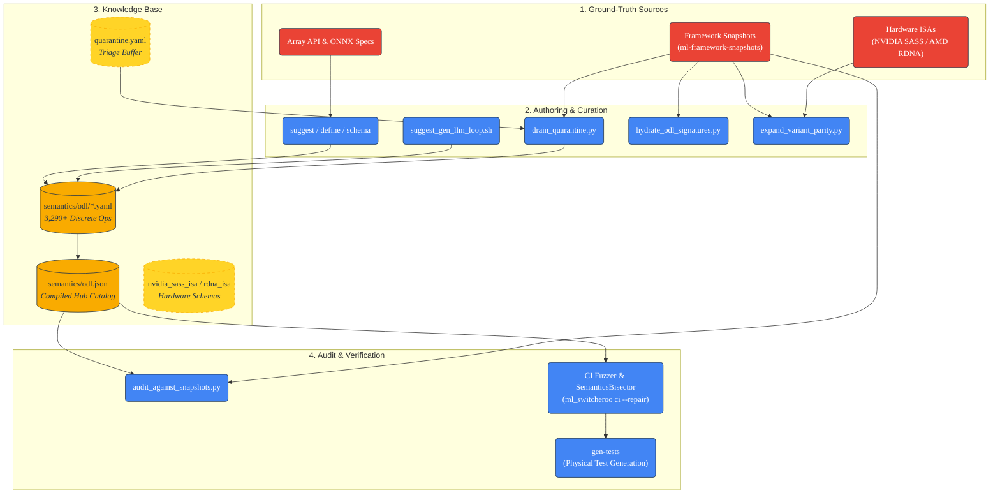

Maintenance
===========


**ml-switcheroo** is a deterministic, specification-driven universal compiler. Its intelligence relies on a distributed **Knowledge Base** separating *Abstract Operation Specifications* (The Hub) from *Framework & Hardware Implementations* (The Spokes).

Maintenance primarily involves synchronizing this knowledge base with upstream framework releases, hardware instruction sets, and grounded snapshot datasets with zero hallucinated APIs.

This guide covers the full compiler lifecycle: **Authoring & Ingestion**, **Quarantine Triage**, **Snapshot Auditing**, **Variant Parity**, **Automated Verification & Repair**, and **Documentation**.

---

## 🔄 The Maintenance Lifecycle

Data flows from authoritative sources (live libraries, ground-truth framework snapshots, hardware ISA manuals) into discrete ODL definitions, through quarantine triage and signature hydration, and finally into verified catalogs and regression suites.



---

## 🛠️ Phase 1: Operation Authoring & Compilation (The Hub)

Operations are authored as atomic YAML files conforming to the **Operation Definition Language (ODL)** schema.

### 1. Exporting Schema

Export the official JSON Schema to validate YAML files during authoring or configure LLM generation constraints:

```bash
ml_switcheroo schema > src/ml_switcheroo/semantics/schema.json
```

### 2. Suggesting Unmapped APIs

Generate structured prompts populated with introspection metadata for unmapped functions:

```bash
# Generate prompt for a single API
ml_switcheroo suggest 'torch.nn.functional.scaled_dot_product_attention' > prompt.md

# Batch-suggest entire namespaces to an output directory
ml_switcheroo suggest 'torch.nn.functional' --out-dir ./suggestions/ --batch-size 20
```

### 3. Automated LLM Generation Loop

Use `scripts/suggest_gen_llm_loop.sh` to run iterative suggestion and definition loops across unmapped framework modules:

```bash
./scripts/suggest_gen_llm_loop.sh
```

### 4. Injecting & Compiling Definitions

Inject the new definition into `src/ml_switcheroo/semantics/odl/` and compile the unified catalog:

```bash
# 1. Inject a validated ODL definition
ml_switcheroo define new_op.yaml

# 2. Compile discrete YAML files into odl.json and validate roundtrips
python3 scripts/compile_odl_catalog.py

# 3. Verify odl.json schema validity
python3 scripts/validate_odl_json.py
```

---

## 🧪 Phase 2: Quarantine Triage & Signature Hydration

To prevent broken or ambiguous definitions from corrupting compilation, unverified operations reside in `src/ml_switcheroo/semantics/quarantine.yaml`.

### Draining Quarantine

`scripts/drain_quarantine.py` audits quarantined operators against ground-truth framework snapshots, extracting convertible operators into discrete ODL YAML files and purging non-convertible artifacts:

```bash
python3 scripts/drain_quarantine.py
```

### Hydrating Signatures

`scripts/hydrate_odl_signatures.py` inspects ground-truth snapshots to extract parameter kinds, positional/keyword boundaries, default values, and variadics, hydrating the canonical `std_args` across all ODL definitions:

```bash
python3 scripts/hydrate_odl_signatures.py
```

### Expanding Variant Parity

`scripts/expand_variant_parity.py` audits operation definitions across the 6 core targets (PyTorch, JAX, MLX, Keras 3, AMD RDNA, NVIDIA SASS) and automatically fills missing variant edges using snapshot symbols and canonical ISA ALU macros:

```bash
python3 scripts/expand_variant_parity.py
```

---

## 🛡️ Phase 3: Ground-Truth Snapshot Auditing

`ml-switcheroo` enforces a strict **Zero-Hallucination** policy: no API or argument mapping may exist in the Knowledge Base unless verified against live framework snapshots.

### Auditing Framework Mappings

```bash
# Audit all ODL definitions and adapters against extracted snapshots
python3 scripts/audit_against_snapshots.py

# Generate markdown and JSON audit reports
python3 scripts/audit_against_snapshots.py --report-md audit_report.md --report-json audit_report.json
```

### Auditing IR Dialects (MLIR & StableHLO)

Verify that intermediate representation emitters adhere strictly to upstream dialect specifications:

```bash
# Audit MLIR dialect coverage
python3 scripts/audit_mlir_spec.py

# Audit StableHLO dialect coverage
python3 scripts/audit_stablehlo_spec.py
```

---

## ✅ Phase 4: Verification & Automated Repair (CI Loop)

We validate the mathematical equivalence of conversions across live frameworks using hypothesis-driven property tests.

### Running Verification & Auto-Repair

When numerical tolerances differ across backends (e.g., float32 precision differences between PyTorch and JAX on certain GPU/CPU kernels), the CI tool can automatically bisect and relax tolerances:

```bash
# 1. Run validation suite and output report
ml_switcheroo ci --json-report verified_ops.json

# 2. Run CI with automated tolerance bisection (SemanticsBisector) and update README
ml_switcheroo ci --repair --update-readme
```

### Physical Test Generation

Generate physical Python test files to freeze verification suites for CI runners without requiring dynamic test harness generation:

```bash
ml_switcheroo gen-tests --out tests/generated/test_tier_a_math.py
```

### Verified Ingestion Pipeline

Verify that an entire model script can be ingested, analyzed, and lowered through the compiler without errors:

```bash
ml_switcheroo verified-pipeline ./models/resnet.py
```

---

## 🔧 Phase 5: Scaffolding, Harvesting & Documentation

### Scaffolding New Frameworks

Scaffold initial mapping templates for new or emerging libraries based on exported namespace introspection:

```bash
ml_switcheroo scaffold tinygrad
```

### Semantic Harvesting

Extract verified argument pivot rules and mappings directly from manual test cases:

```bash
ml_switcheroo harvest tests/test_custom_add.py
```

### Generating Migration Guides

Generate high-level Markdown documentation comparing API structures between frameworks:

```bash
ml_switcheroo gen-docs --source torch --target jax --out ./MIGRATION_GUIDE.md
```

---

## 📚 Documentation & Web Demo

The project documentation (Sphinx) includes a client-side WebAssembly (WASM) demo powered by Pyodide.

### Time-Travel Interactive UI

The demo includes a "Time-Travel" stepping interface implemented via WASM. This allows users to inspect exactly how the AST evolves pass-by-pass during the translation of their ML code, offering complete transparency into the translation pipeline without spinning up an environment.

### Building Docs & Wheel

The documentation build script automatically packages the current source into a `.whl` and injects it into the static site assets:

```bash
python3 scripts/build_docs.py
```

---

## 🗃️ Glossary of Knowledge Base Artifacts

| Artifact Path | Classification | Role & Purpose | Maintenance Tool |
| :--- | :--- | :--- | :--- |
| `src/ml_switcheroo/semantics/odl/*.yaml` | **Hub (ODL)** | Discrete, human-readable YAML specifications for 3,290+ abstract operations. | `ml_switcheroo define`, `drain_quarantine.py` |
| `src/ml_switcheroo/semantics/odl.json` | **Hub (Catalog)** | Compiled, deterministic JSON database of all operations used at runtime. | `scripts/compile_odl_catalog.py` |
| `src/ml_switcheroo/semantics/quarantine.yaml` | **Triage Buffer** | Staging ground for non-standard, ambiguous, or unverified operations. | `scripts/drain_quarantine.py` |
| `src/ml_switcheroo/semantics/nvidia_sass_isa.yaml` | **Hardware Spec** | Declarative instruction set architecture schema for NVIDIA SASS (Ampere/Hopper). | `scripts/expand_variant_parity.py` |
| `src/ml_switcheroo/semantics/rdna_isa.yaml` | **Hardware Spec** | Declarative instruction set architecture schema for AMD RDNA (GFX10/GFX11). | `scripts/expand_variant_parity.py` |
| `src/ml_switcheroo/semantics/schema.yaml` | **Schema** | Formal Pydantic/JSON schema defining valid ODL syntax, constraints, and traits. | `ml_switcheroo schema` |
| `snapshots/{fw}_v*.json` | **Ghost Snapshot** | Serialized API symbols, arguments, and type hierarchies from ground-truth environments. | `scripts/audit_against_snapshots.py` |
