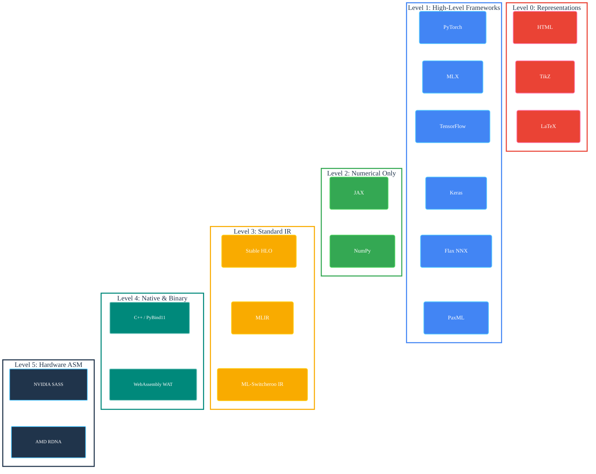
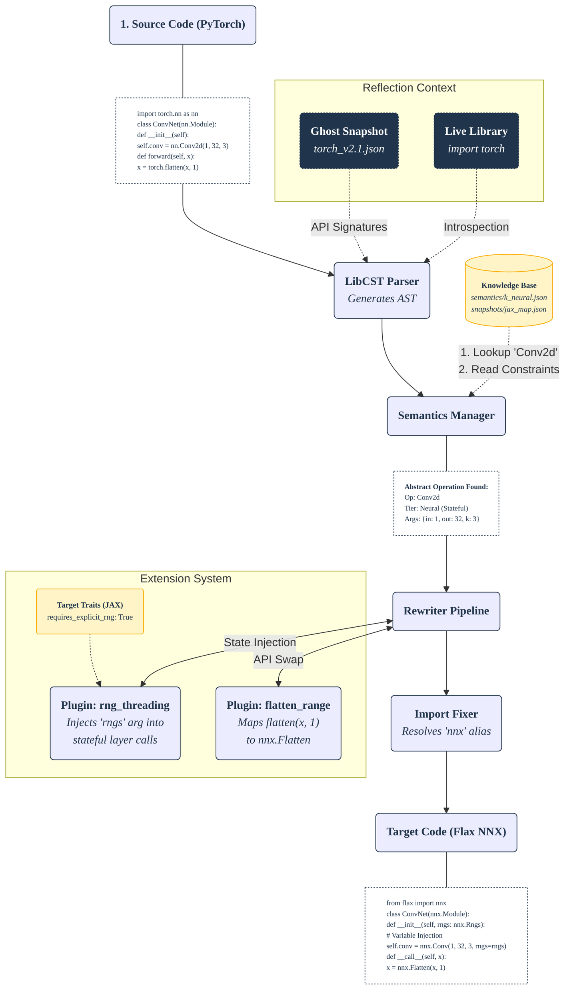

ml-switcheroo 🔄🦘
==================

**A Universal Compiler for Deep Learning: From High-Level APIs to Hardware Assembly.**

[](https://opensource.org/license/apache-2-0)
[](https://www.python.org/downloads/)
[](https://github.com/SamuelMarks/ml-switcheroo/actions/workflows/test_and_release.yml)


[](https://github.com/astral-sh/ruff)
[](https://samuelmarks.github.io/ml-switcheroo/)

*Usable via either the `ml_switcheroo` command or its CLI emoji alias `🔄🦘`.*

**ml-switcheroo** has evolved from a simple AST transpiler into a deterministic **Universal Compiler** for Machine Learning. It enables conversion between distinct levels of the ML stack: from high-level frameworks (PyTorch, JAX, Apple MLX, Keras 3), down to hardware assembly (NVIDIA SASS, AMD RDNA), native C++ PyBind11 extensions, WebAssembly (WAT), and visual documentation formats (TikZ, HTML, LaTeX). **Note: Conversion to intermediate representations like StableHLO is currently in alpha/experimental state and is not yet loss-less.**

It solves the $O(N^2)$ interoperability problem using a **Hub-and-Spoke** architecture. Instead of writing translators for every pair of languages, we map every dialect to a central **Abstract Standard** (Hub).



---

## 🚀 Key Capabilities

### 1. Syntactic Transpilation (Python ↔ Python & Python → C++)
Convert model code between frameworks with semantic fidelity, or export to native C++ extensions.
*   **PyTorch** ↔ **JAX / Flax NNX** ↔ **Apple MLX** ↔ **Keras 3** ↔ **TensorFlow**
*   **Target: C++ / PyBind11 (Compiler SDK)**: Compiles forward passes and custom operators into native PyTorch C++ extension modules (`TorchCppExtensionGenerator` in `ml_switcheroo.core.compiler.backends.cpp`) with full C++ CST parsing and AST transformation.
*   Handles class rewriting (`nn.Module` -> `nnx.Module`), state injection (RNG keys), and functional unwrapping.

### 2. Architecture Visualization & WebAssembly (Python → Visuals & WAT)
Compile your model graphs directly into diagramming languages and portable execution formats.
*   **Target: TikZ**: Generates publication-ready LaTeX TikZ code for academic papers (`--target tikz`).
*   **Target: LaTeX DSL**: Transpiles computational expressions into mathematical LaTeX equations (`--target latex_dsl`).
*   **Target: HTML**: Generates static Grid CSS responsive layouts to visually inspect module hierarchies (`--target html`).
*   **Target: WebAssembly (WAT)**: The `WasmBackend` (`ml_switcheroo.core.compiler.backends.wasm_backend`) generates stack-based WebAssembly Text representations directly from `LogicalGraph` for sandboxed or browser-based runtime verification.

### 3. Hardware Lowering, Decompilation & Cross-ISA (Python ↔ ASM, SASS ↔ RDNA)
Bridge the gap between high-level neural networks and raw GPU assembly.
*   **Lowering (Python → ASM)**: Compiles `LogicalGraph` operations into NVIDIA SASS or AMD RDNA machine instruction kernels.
*   **Decompilation (ASM → Python)**: Reconstructs loops (e.g. `Conv2d` and GEMM kernels) from raw assembly streams using Control Flow Graph (CFG) reconstruction, basic block separation, and dominator tree analysis.
*   **Cross-ISA Translation (SASS ↔ RDNA)**: Translates directly between NVIDIA SASS and AMD RDNA instruction streams (e.g., `FFMA` / `LDG` ↔ `v_fmac_f32` / `global_load`).

### 4. Weight Migration (Checkpointing)
Generate standalone scripts to convert model weights between formats.
*   Reads source AST to determine layer mappings.
*   Generates `orbax` / `torch.save` / `safetensors` (PyTorch, JAX, MLX) / `h5py` (`.keras`) migration logic.
*   Automatically handles NCHW ↔ NHWC layout permutation.

### 5. Auto-Sharding, Distributed Semantics & Architecture Fusion
Automatically optimize model topologies and infer distributed sharding constraints.
*   **Distributed Sharding**: Uses `ShardingInferencePass` to analyze unannotated graphs and inject `LogicalMesh` and `PartitionSpec` annotations (column-parallel, row-parallel, data-parallel heuristics) for PaxML and JAX/NNX targets.
*   **Architecture Fusion Passes**:
    *   `QKVFusionPass` / `QKVDefusionPass`: Automatically fuse or separate `q_proj`, `k_proj`, `v_proj` projections in Transformer models.
    *   `SwiGLUFusionPass` / `SwiGLUDefusionPass`: Detect and fuse separate `gate_proj` and `up_proj` linear layers into unified `SwiGLU` blocks (e.g., for Qwen architectures).
    *   `VisionPatchEmbeddingFusionPass` / `VisionPatchEmbeddingDefusionPass`: Restructure and optimize patch embedding projections for multimodal vision-language models.
*   **Topological Diff Engine**: `GraphDiffer` computes granular patch actions (`DeleteAction`, `ReplaceAction`) between logical computation graphs.

### 6. Hexagonal Static Transpilation Lattice (30 Directed Paths)
Bidirectional static source-to-source conversion across the 6 core targets:
*   **High-Level Frameworks (12 Edges)**: **PyTorch** ↔ **JAX / Flax NNX** ↔ **Apple MLX** ↔ **Keras 3**.
*   **Hardware Bridge Lowering (8 Edges)**: High-Level Models → `LogicalGraph` IR → **AMD RDNA** & **NVIDIA SASS**.
*   **Hardware Bridge Lifting (8 Edges)**: Disassembly / Macro Streams → `LogicalGraph` IR → High-Level Modules.
*   **Cross-ISA Direct Compilation (2 Edges)**: **AMD RDNA** ↔ **NVIDIA SASS**.
*   **Ground Truth Grounding**: Formally verified against live framework snapshots in `ml-ecosystem-snapshots` (with backward compatibility for `ml-framework-snapshots`) and `ml-compiler-snapshots` with zero hallucinated APIs or arguments.
*   **YAML-First Semantics**: Built on 3,290+ modular operation definitions (currently 3,291 compiled ops in `src/ml_switcheroo/semantics/odl.json`).

---

## 🏗️ Architecture

The engine uses a dual-path pipeline to handle both structured code (Python) and linear streams (ASM).



---

## 📦 Installation

```bash
# Install from source
pip install .

# Install with testing dependencies (necessary for Fuzzer/Verification)
pip install ".[test]"
```

---

## 🛠️ CLI Usage

The `ml_switcheroo` CLI (or `🔄🦘`) is your gateway to the compiler stack.

### 1. Code Conversion (`convert`)
Transpile source code, lower to hardware assembly, or decompile ASM to Python.

```bash
# Standard: PyTorch -> JAX
ml_switcheroo convert ./models/resnet.py --target jax --out ./resnet_jax.py

# Batch Directory Conversion: Recursively transpile an entire codebase
ml_switcheroo convert ./torch_models/ --target jax --out ./jax_models/

# Visualization: Python -> LaTeX (TikZ)
ml_switcheroo convert ./models/transformer.py --target tikz --out ./diagram.tex

# Mathematics: Python -> LaTeX math equations
ml_switcheroo convert ./models/attention.py --target latex_dsl --out ./equations.tex

# Hardware Lowering: Python -> AMD RDNA assembly
ml_switcheroo convert ./models/conv.py --target rdna --out ./conv.rdna

# Decompilation: NVIDIA SASS -> Python
ml_switcheroo convert ./kernels/gemm.nvidia_sass --source nvidia_sass --target python

# Distributed Sharding Inference: PyTorch -> PaxML (tensor/FSDP parallelism)
ml_switcheroo convert ./models/llama.py --target paxml --sharding --out ./llama_pax.py

# Verified Conversion with Intermediate Representation Roundtrip and Execution Trace:
ml_switcheroo convert ./models/resnet.py --target jax --intermediate ir --verify --strict \
    --json-trace trace.json --config use_custom=True epsilon=1e-5
```

### 2. Weight Migration (`gen-weight-script`)
Generate a standalone Python script to migrate checkpointed weights between frameworks.

```bash
# Generate a conversion script (PyTorch -> JAX Orbax)
ml_switcheroo gen-weight-script ./src_model.py \
    --source torch --target jax \
    --out ./migrate_weights.py

# Run the generated script
python migrate_weights.py input.pth output_ckpt/
```

### 3. Verification & CI (`ci`)
Run the mathematical fuzzer to verify Knowledge Base operations and automatically repair tolerances.

```bash
# Run hypothesis validation tests across installed frameworks and dump a JSON report
ml_switcheroo ci --json-report verified_ops.json

# Run CI with automated tolerance bisection to repair failing constraints
ml_switcheroo ci --repair --update-readme
```

### 4. Discovery & Autogen (`suggest`, `define`, `schema`)
"Teach" the compiler new operations using LLM assistance and ODL (Operation Definition Language). You can also use `scripts/suggest_gen_llm_loop.sh` to automate iterative LLM feedback loops for bulk-mapping entire namespaces.

```bash
# 1. Export the official ODL JSON Schema for LLM validation and prompt engineering
ml_switcheroo schema > odl_schema.json

# 2. Generate an LLM prompt with introspection data for a single unmapped API
ml_switcheroo suggest 'torch.nn.functional.scaled_dot_product_attention' > prompt.md

# 3. Bulk Namespace Scanning: Batch-generate structured prompts for an entire module
ml_switcheroo suggest 'jax.numpy.*' --out-dir ./prompts --batch-size 50

# 4. (Paste prompt to LLM, get validated ODL YAML back)

# 5. Inject the new definition into the Knowledge Base
ml_switcheroo define new_ops.yaml
```

### 5. Advanced Tooling / SDK
ml-switcheroo provides developer tools for mapping new libraries, harvesting unit tests, and running verified ingestion.

```bash
# Scaffold an API mapping template for a new library based on __all__ exports
ml_switcheroo scaffold my_custom_lib

# Harvest mappings and behavioral constraints from manual unit tests
ml_switcheroo harvest ./tests/my_custom_lib/

# Run code through the verified ingestion pipeline
ml_switcheroo verified-pipeline ./models/resnet.py

# Generate a migration guide Markdown comparing two frameworks
ml_switcheroo gen-docs --source torch --target jax --out ./MIGRATION_GUIDE.md

# Generate physical Python test files based on the semantic definitions
ml_switcheroo gen-tests --out ./tests/generated/test_tier_a_math.py
```

---

## ✅ Compatibility Matrix

Core target support status across the compiler lattice:

| Category | Dialect / Target | Status | Supported Features |
|:---|:---|:---:|:---|
| **High-Level Frameworks** | **PyTorch** | 🟢 Primary | Source/Target, `nn.Module`, `functional`, Optimizers, DataLoaders, C++ export |
| | **JAX / Flax NNX** | 🟢 Primary | Source/Target (`flax.nnx`), `vmap`, `grad`, `jit`, Orbax Checkpointing, RNG keys |
| | **Apple MLX** | 🔵 Beta | `mlx.nn` layers, `mlx.core` array ops, MLX optimizers |
| | **Keras 3** | 🔵 Beta | Multi-backend layers, `keras.ops` math, Sequential restructuring |
| | **TensorFlow** | 🔵 Beta | Keras Layer conversion, `tf.data`, IO operations |
| | **NumPy** | 🟡 Stable | Array operations, fallback target for pure math |
| | **PaxML** | ⚪ Alpha | `praxis` layer structure translation |
| **Hardware ISAs** | **NVIDIA SASS** | 🟢 Primary | Ampere/Hopper assembly, `FFMA`/`LDG` loop CFG reconstruction & lowering, cross-ISA |
| | **AMD RDNA** | 🟢 Primary | GFX10/GFX11 assembly, `v_fmac_f32` loop reconstruction & lowering, cross-ISA |
| **Intermediate Reps** | **ML-Switcheroo IR** | 🟢 Primary | Unified `LogicalGraph`, `PartitionSpec`, `LogicalMesh`, topological diff engine |
| | **MLIR** | ⚪ Alpha | MLIR CST/AST parser, dialect emission, type inference |
| | **StableHLO** | ⚪ Alpha | StableHLO dialect parser and emitter (bitwise, math, complex linalg, shapes) |
| **Native & Visual** | **C++ (PyBind11)** | 🔵 Beta | Native C++ extension module generation (`TorchCppExtensionGenerator`), CST parser & transformer (Compiler SDK) |
| | **TikZ** | 🟢 Primary | Publication-ready LaTeX TikZ neural network diagram generation (`--target tikz`) |
| | **LaTeX DSL** | 🟢 Primary | Mathematical LaTeX equation transpilation (`--target latex_dsl`) |
| | **HTML** | 🟢 Primary | Static Grid CSS responsive architecture layouts (`--target html`) |
| | **WebAssembly (WAT)** | 🟢 Primary | Stack-based WebAssembly Text (`WasmBackend` WAT) from `LogicalGraph`; Pyodide in-browser runtime |

To view the interactive, live compatibility table for your installed version and local extensions:

```bash
ml_switcheroo matrix
```

---

## 🧠 Advanced Capabilities

### Functional Unwrapping
Frameworks like **JAX** require pure functions. ml-switcheroo automatically detects stateful imperative patterns (like `drop_last=True` in loops or in-place lists) and warns via the **Purity Scanner**.
When converting functional paradigms (like **Flax Linen**) to Object-Oriented paradigms (like **PyTorch** or **Flax NNX**), it unwraps `layer.apply(params, x)` calls into standard `layer(x)` calls using `Assign` restructuring.

### Graph-Guided Rewriting (Loopback Bridge) & Fusion
The **Loopback Bridge** enables high-level architectural optimizations (like layer fusion and auto-sharding) to be applied directly to the low-level source code preservation layer, bridging graph analysis with AST manipulation.
*   **Transformer & Qwen Topology Passes**: Includes `QKVFusionPass` / `QKVDefusionPass`, `SwiGLUFusionPass` / `SwiGLUDefusionPass`, and `VisionPatchEmbeddingFusionPass` / `VisionPatchEmbeddingDefusionPass` to fuse projections into efficient single-kernel constructs (or defuse them for target frameworks lacking fused kernels).
*   **Topological Diff Engine**: `GraphDiffer` computes explicit `DeleteAction` and `ReplaceAction` transformation steps between graphs.

### State Injection (RNG Threading)
When converting **PyTorch** (global RNG state) to **JAX** (explicit RNG keys), the engine:
1. Detects stochastic operations (Dropout, Random init) via the **Analyzer**.
2. Injects an `rng` argument into function signatures.
3. Injects `rng, key = jax.random.split(rng)` preambles.
4. Threads the `key` argument into relevant function calls.

### Static Safety & Analysis Suite
*   **Purity Scanner**: Inspects code for mutations, in-place tensor operations, and hidden state (`ml_switcheroo.analysis.purity`).
*   **Dependency Scanner**: Audits third-party library imports across translation boundaries to verify target environment compatibility (`ml_switcheroo.analysis.dependencies`).
*   **Lifecycle & Initialization Tracker**: Validates that attributes accessed in `forward()` are declared during `__init__()`, preventing dynamic state leakage during static graph compilation (`ml_switcheroo.analysis.lifecycle`).
*   **Static Safety Analyzer**: Evaluates dtypes, shape dimension consistency, and device allocations across translation boundaries (`ml_switcheroo.analysis.static_safety`).
*   **CFG & Dominator Trees**: Reconstructs control-flow graphs and dominator relationships from assembly streams to isolate loops and basic blocks (`ml_switcheroo.analysis.cfg`, `dominators`).
*   **Audit Analyzer & Symbol Table**: Tracks lexical scopes and variable lifetimes across transpilation passes (`ml_switcheroo.analysis.symbol_table`).

### Error Handling & Pass-Through Protocol (Escape Hatch)
To guarantee compilation resilience, the engine includes an **Escape Hatch** (`ml_switcheroo.core.escape_hatch`):
*   In standard mode, any AST node that cannot be deterministically transpiled is safely wrapped in `# <SWITCHEROO_FAILED_TO_TRANS>` comment boundaries, emitting the original code unchanged without silent corruption.
*   When `--strict` is enabled, any unmapped operation or ambiguous signature immediately raises an explicit compilation error.

### Intelligent Import Management
The **Import Fixer** does not just swap strings; it analyzes usage logic:
* Removes unused source imports (`import torch`).
* Injects required target imports (`import jax.numpy as jnp`) only if referenced.
* Handles alias conflicts (`import torch as t`).

---

## 🔌 Extensibility

ml-switcheroo is designed to be extended without modifying the core engine.

1. **Add Operations (ODL)**: Use the **Operation Definition Language (YAML)** to define math/neural ops. This is the recommended way to add missing functionality.
   See [EXTENDING_WITH_DSL.md](EXTENDING_WITH_DSL.md) for the full guide.
   * **Catalog Compilation**: Discrete YAML definitions in `src/ml_switcheroo/semantics/odl/` compile into the unified JSON catalog via `python scripts/compile_odl_catalog.py`.
   * **Schema Validation**: Verified with `python scripts/validate_odl_json.py` against Pydantic models.
   * **Quarantine Promotion**: Graduated into official standards via `python scripts/drain_quarantine.py`.

2. **Add a Framework**: Create a class inheriting `FrameworkAdapter` in `src/ml_switcheroo/frameworks/`.
   See [EXTENDING.md](EXTENDING.md) for architectural details on Adapters and Plugins.

3. **Modular AST Plugins**: Leverage the 35+ specialized plugins in `src/ml_switcheroo/plugins/`:
   * **Distributed**: `auto_fsdp_wrapper` (graph-level sharding passes reside in `core/compiler/sharding.py`)
   * **State & Lifecycle**: `state_flag_injection`, `state_container`, `device_allocator`, `device_checks`, `rng_threading`
   * **Tensor Layout & Packing**: `attention_packing`, `shape_packing`, `einsum`, `gather`, `scatter`, `padding`, `reshape`, `flatten`, `topk`, `in_top_k_plugin`, `batch_norm`
   * **Training & Optimization**: `optimizer_step`, `schedulers`, `clipping`, `loss_wrapper`, `checkpoint_keys`
   * **Functional Control Flow**: `inplace_unroll`, `loop_unroll`, `static_unroll`, `context_to_function_wrap`
   * **Framework Specific**: `mlx_optimizers`, `mlx_extras`, `nnx_to_torch_params`, `jax_decompose`, `keras_sequential`, `tf_data_loader`, `data_loader`

4. **Interactive Documentation (Sphinx & WASM)**:
   * Powered by `ml_switcheroo.sphinx_ext`, the documentation includes an interactive in-browser compiler demo (`.. switcheroo_demo::`) running via Pyodide / Emscripten without heavy server-side Python dependencies.

---

## License

[Apache-2.0](LICENSE)
