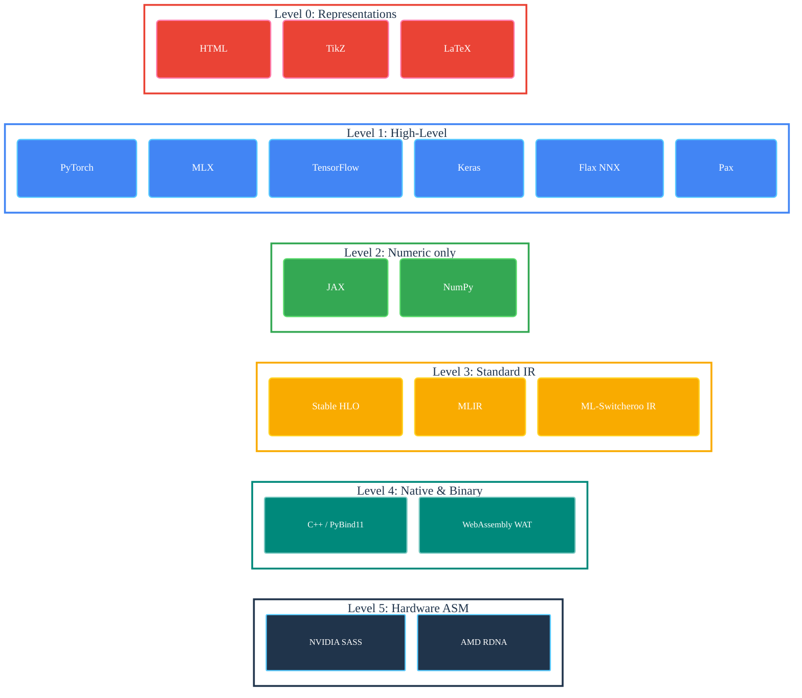

ml-switcheroo 🔄🦘
==================

A Deterministic, Specification-Driven Transpiler for Deep Learning Frameworks.

## Interactive Demo

Try it right in your browser! The engine runs entirely client-side using WebAssembly.

```{switcheroo_demo}
```



```{toctree}
:maxdepth: 2
:caption: Documentation

README
ARCHITECTURE
EXTENDING
EXTENDING_WITH_DSL
MAINTENANCE
INTERNALS
IDEAS
```

```{toctree}
:maxdepth: 3
:caption: Reference

api/index
ops/index
```

## Indices and tables

* {ref}`genindex`
* {ref}`modindex`
* {ref}`search`
